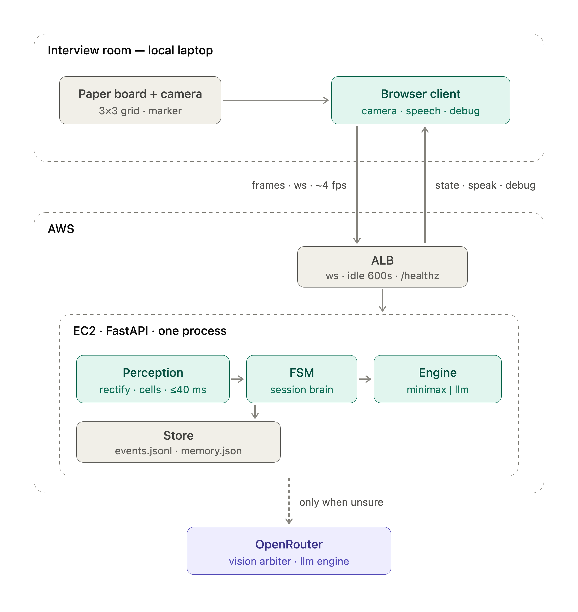
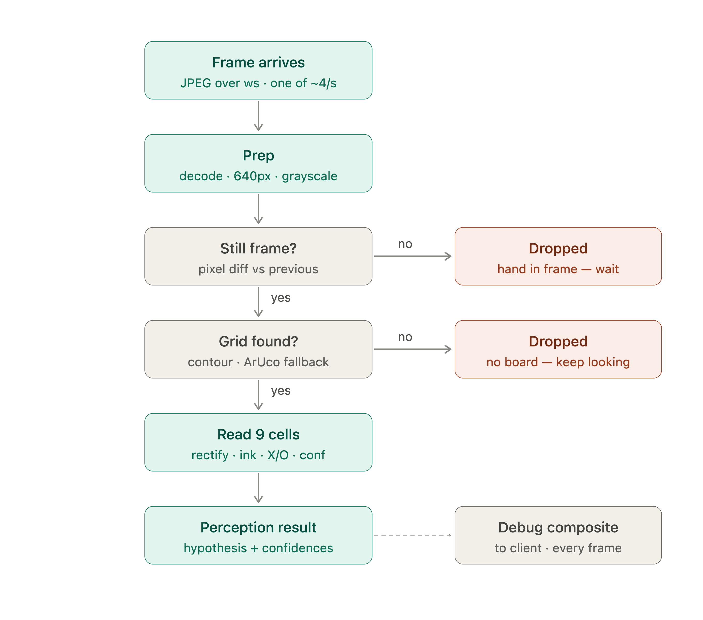
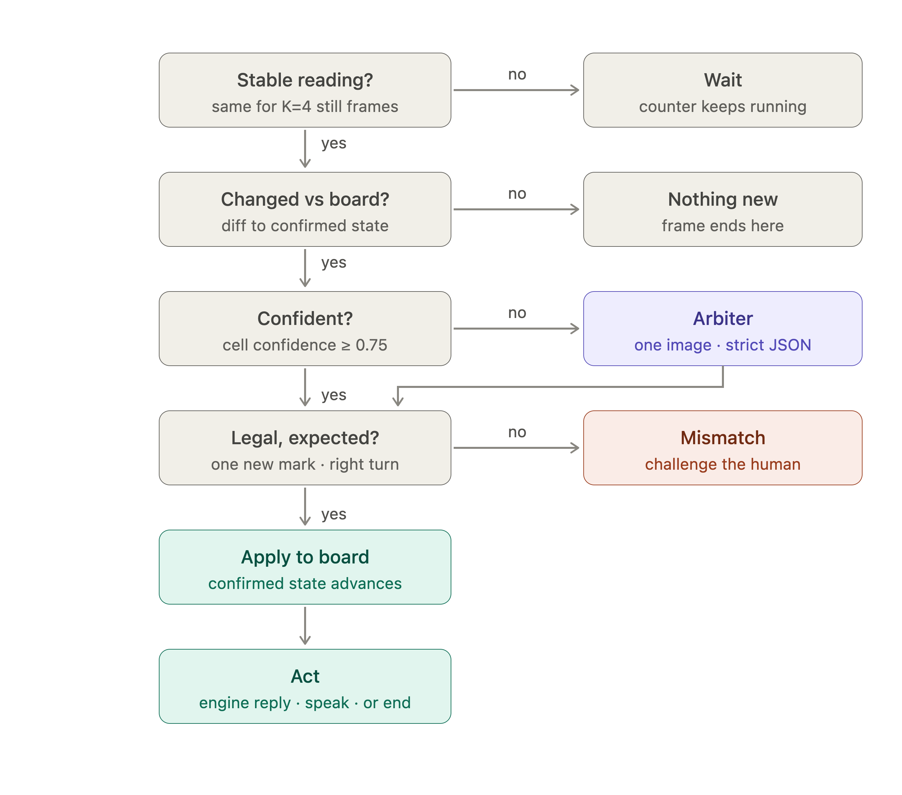
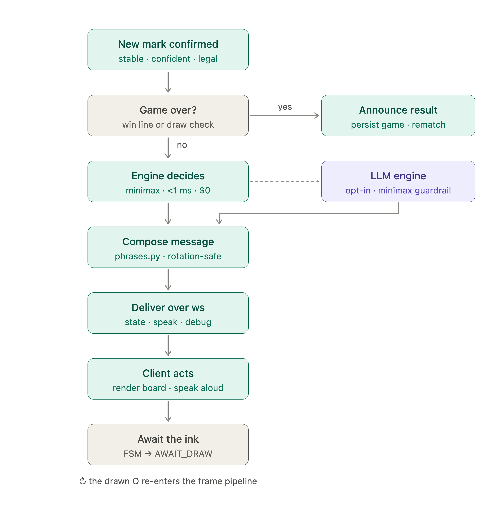
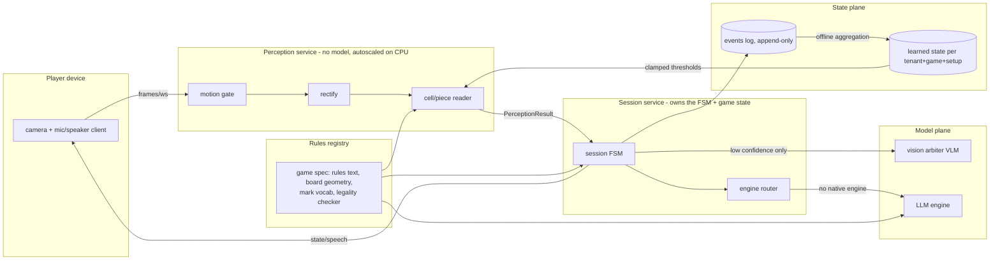

# Architecture — what's built, and the game-agnostic expansion

## What's built (the demo system)

Frame path, per frame (≤40ms classical CV):

Decision on a stable reading:

From confirmed mark to spoken move:

One FastAPI process. The browser owns camera and speech; the server owns
perception, session state (FSM), decision, and persistence. A vision model is
consulted only when classical CV admits uncertainty; move selection is
minimax behind an `Engine` protocol with a game-agnostic LLM engine one
config line away.

## The game-agnostic expansion (Section 3)

**End-to-end flow.** Frame → motion gate → rectify → per-cell read →
`PerceptionResult` → FSM debounce → legality → engine → announce → client
speaks; the confirmed move is appended to the event log. Inference sits in
exactly two places, both off the per-frame path: the vision arbiter (one
rectified image, only when per-cell confidence < threshold) and the optional
LLM engine (one call per agent turn, only for games without a closed-form
engine). Vendors via one gateway (OpenRouter today) so models are a config
string; current picks: Claude Sonnet for both arbiter and engine. The offline
path is a nightly (or post-game) aggregation job over the event log that
recomputes per-setup thresholds and writes them to learned state — nothing
learns online inside a session.

**Services and boundaries.** Perception is a stateless CPU service (no model;
geometry only) — scale horizontally per stream. The session service owns the
FSM, the confirmed board, and turn logic; it is the only writer of game state
and the only caller of models. What crosses the boundary is exactly the
`PerceptionResult` (symbolic cells + confidences + geometry) — never pixels,
except the single rectified crop attached to an arbiter escalation. The model
plane needs models; perception and session do not.

**Rules ingestion.** A new game is data, not code: a game spec bundle (rules
text for the LLM engine, board geometry for the reader, mark/piece vocabulary,
and a legality checker — a declarative move grammar, or a sandboxed WASM
validator for games where legality is code) uploaded to the rules registry.
The demo repo shows the seam in miniature: `games/<name>/` packages behind a
`Game` protocol, with `chess/` empty on purpose. The LLM engine already plays
any game the registry can describe; only games wanting a perfect native
engine ship one.

**Shared and per-tenant.** Shared: model weights (vendor-hosted), the
perception/session/announcer code, per-game rules and phrase packs. Per-tenant
(a data namespace, not code — `runs/<tenant>/<game>/<setup>`): learned
thresholds and calibration, event logs, game records, API keys/endpoints if a
tenant brings their own model. Nothing learned for one tenant's lighting or
handwriting ever influences another's reads.

**Feedback at scale.** Learned state lives in the state plane keyed by
tenant+game+setup, versioned, written only by the offline aggregation job —
sessions read a pinned version at start. Bad updates are contained three
ways: every learned value passes through hard-coded clamp ranges at the point
of use (implemented in the demo: `store.CLAMPS`); a new version canaries
against the previous one on held-out logged frames (misread rate must not
regress) before promotion; and rollback is a pointer flip because versions
are immutable. With a handful of games per setup, improvement is claimed only
on aggregate misread/arbiter-rate trends, not single-game deltas — small-n
variance is the stated caveat.

**Versioning and failure.** Every decision record already carries the
provenance tuple: git SHA, config hash, engine type, resolved model id as
returned by the API, thresholds in effect, learned-state version — one grep
reconstructs any move. Under load the frame path degrades first and safest:
perception queues drop frames (the game needs stability, not every frame,
so 4fps → 1fps is invisible); next the arbiter rate-limits (falls back to
asking the human — the designed behavior for uncertainty); the session FSM
and event log are tiny and fail last. The failure mode that matters is a
silently wrong confirm, which is why confirm requires K stable frames plus
legality, and why the human is always shown what the agent believes.
